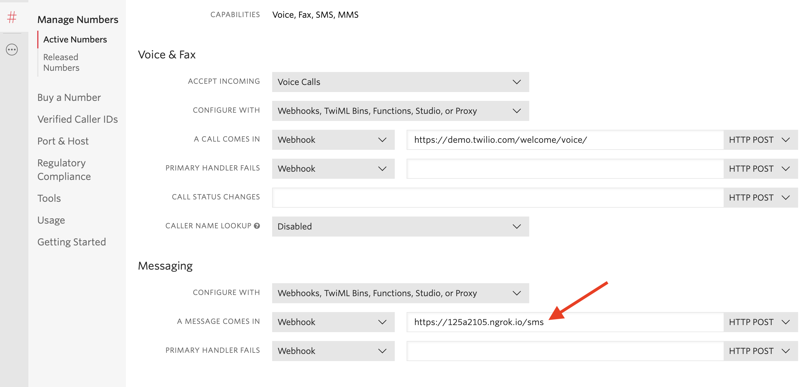

# sms-location-bot

`I’m a bot! You send me a location via SMS, and I reply with the nearest location I know of for the thing I know how to locate.`

## Running `sms-location-bot`

`sms-location-bot` is an Express app that can be run via e.g. `node index.js`, but see configuration documentation below.
It has a `POST` endpoint at `/sms` and is designed to be used as a Twilio [webhook](https://www.twilio.com/docs/sms/quickstart/node).
It _also_ expects to be run in some kind of host that handles SSL termination on its behalf and so uses HTTP.

To run `sms-location-bot`, first get yourself a Twilio number that can receive and send SMS. Then, execute `node index.js` in some kind of container that is capable of terminating SSL and setting `PORT` and `DATA_URL` in the process environment (Heroku dyno, DO droplet, AWS Elastic Beanstalk, etc.) and point a stable DNS name at the running instance location.
Next, provide that DNS name plus `/sms` to your Twilio number's webhook for incoming messages:



Texts to your Twilio number will now process the incoming message for inputs (e.g., ZIP codes), look up relevant data in the `DATA_URL` file, and compile a response.

## Configuring `sms-location-bot`

### Environment variables

Here is a list of the configuration parameters `sms-location-bot` expects to find in its process environment:

- `PORT`: the HTTP port for the Express server to listen on
- `DATA_URL`: the location of the `geo.json`-style location file

### Data format

`sms-location-bot` expects to find at `DATA_URL` a JSON file describing the resources it is helping callers to locate.
The first use of `sms-location-bot` for the Hurricane Barry response in 2019 leveraged an existing `geo.json` file with
a shape like:

```json
{"type":"FeatureCollection",
    "features":[
        {"type":"Feature",
            "geometry":{"type":"Point","coordinates":[xx.nnnn,yy.nnnn]},
            "properties":{"accepting":"yes",
                "shelter":"Shelter Name","address":"Full mailing address","city":"CITY_NAME","state":"ST","county":"County Name","zip":"99999","phone":null,"updated_by":null,"notes":null,"volunteer_needs":null,"longitude":-99.7487,"latitude":40.7868,"supply_needs":null,"source":"Source org id","google_place_id":null,"special_needs":null,"id":2,"archived":false,"pets":"No","pets_notes":null,"needs":[],"updated_at":"2019-07-11T13:52:43-05:00","updatedAt":"2019-07-11T13:52:43-05:00","last_updated":"2019-07-11T13:52:43-05:00","cleanPhone":"badphone"}},
            ...
    ]
}
```

The `extractGeoJsonData` function in `index.js` expects this format implicitly:

```javascript
const extractGeoJsonData = (json) => {
    let extractedData = new Map();
    json.features.map((val, _idx, _ary) => {
        const { zip } = val.properties;
        if(!extractedData.has(zip)) {
            extractedData.set(zip, new Array());           
        }
        extractedData.get(zip).push(val.properties);
    });
    return extractedData;
}
```

Working with other data formats, even ones that depend on some other key than ZIP code like area code, date, etc. would need to alter `extractGeoJsonData` to suit.

## Tests

PRs are welcome!
